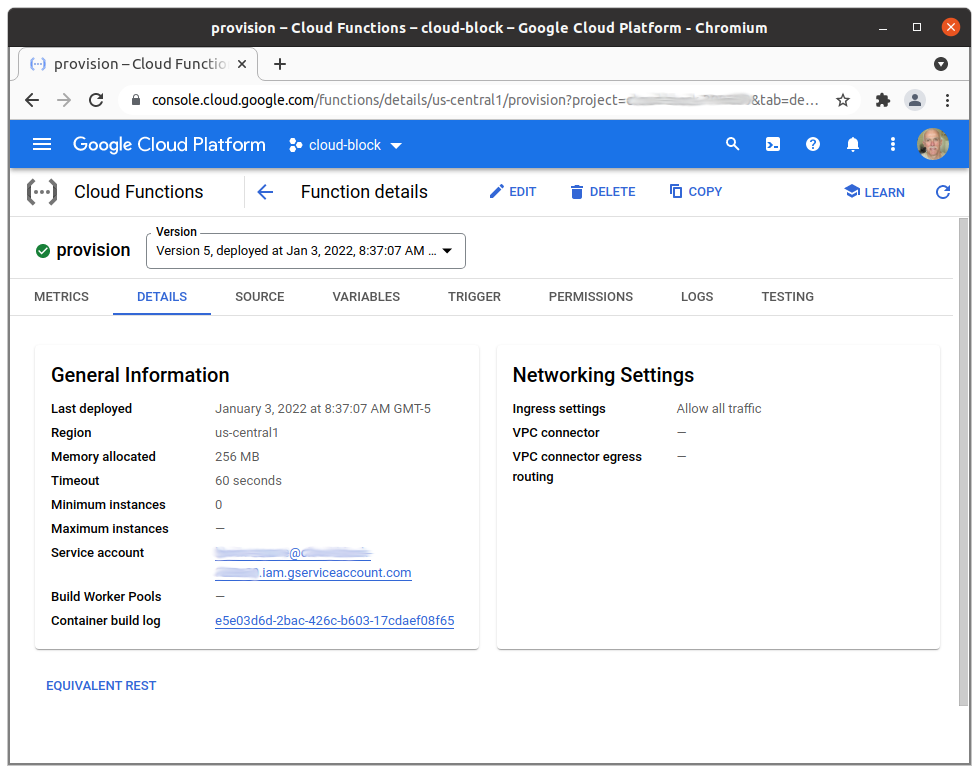

# Google Cloud Function for IoT Device Provisioning

This Cloud Function allows you to provision and synchronize a balena device with Google Cloud IoT Core in a secure and automated way via an HTTP endpoint. The Cloud Function may be called by a balena device, as seen in the [cloud-relay](https://github.com/balena-io-examples/cloud-relay) example.

| Method | Action |
|-------------|--------|
| POST | Provisions a balena device with IoT Core. First the function verifies the device UUID with balenaCloud. Then it creates a public/private key pair and adds the device to the registry. Finally the function sets balena device environment variables for these entities. |
| DELETE | Removes a balena device from the IoT Core registry and removes the balena device environment variable for the private key. Essentially reverses the actions from provisioning with HTTP POST. |

## Device Environment Variables
Once the Cloud function has provisioned the device with GCP, it sets balena device environment variables as described below, which allow the device to connect to IoT Core. Some aspects of the variable values are common across devices, and are collected from the cloud function deployment.

| Variable | Value |
|----------|-------|
| GCP_CLIENT_PATH | `<registry-path>/devices/<device-id>`<br><br> `<registry-path>` is derived from the project ID, GCP region, and registry ID<br>`<device-id>` is derived from the balena UUID for the device |
| GCP_DATA_TOPIC_ROOT | `/devices/<device-id>` |
| GCP_PROJECT_ID | Google Cloud project ID |
| GCP_PRIVATE_KEY | Private key in PEM format, base64 encoded to eliminate line wrapping |


## Setup and Testing
### GCP setup
The Cloud Function interacts with Google Cloud IoT Core via client code operating with service account credentials. You must setup a Google Cloud project with an IoT Core registry. The service account must have the *Cloud IoT Provisioner* role to manage device records in the IoT Core registry. See the IoT Core [documentation](https://cloud.google.com/iot/docs/how-tos) for more background.

### Workspace setup
Clone this repo
```
$ git clone https://github.com/balena-io-examples/gcp-iot-provision
```

The sections below show how to test the Cloud Function on a local test server and deploy to Cloud Functions. In either case you must provide the environment variables in the table below as instructed for the test/deployment.

| Key         |    Value    |
|-------------|-------------|
| BALENA_API_KEY | for use of balena API; found in balenaCloud dashboard at: `account -> Preferences -> Access tokens` |
| GCP_PROJECT_ID | Google Cloud project ID, like `my-project-000000`|
| GCP_REGION | Google Cloud region for registry, like `us-central1` |
| GCP_REGISTRY_ID | Google Cloud registry ID you provided to create the registry |
| GCP_SERVICE_ACCOUNT |base64 encoding of the JSON formatted GCP service account credentials provided by Google when you created the service account. Example below, assuming the credentials JSON is contained in a file.<br><br>`cat <credentials.txt> \| base64 -w 0` |

### HTTP API
The HTTP endpoint expects a request containing a JSON body with the attributes below. Use POST to add a device to the cloud registry, DELETE to remove.

| Attribute | Value |
|-----------|-------|
| uuid | UUID of device  |
| balena_service | (optional) Name of service container on balena device that uses provisioned key and certificate, for example `cloud-relay`. If defined, creates service level variables; otherwise creates device level variables. Service level variables are more secure. |


### Test locally
The Google Functions Framework is a convenient tool for local testing. 
First, start a local HTTP server ([docs reference](https://cloud.google.com/functions/docs/running/function-frameworks)) using a script like below.

```
export BALENA_API_KEY=<...>
... <other environment variables from table above>
export GCP_SERVICE_ACCOUNT=<...>

npx @google-cloud/functions-framework --target=provision
```

Next, use `curl` to send an HTTP request to the local server to provision a device. See the *HTTP API* section above for body contents.

```
curl -X POST http://localhost:8080 -H "Content-Type:application/json" \
   -d '{ "uuid": "<device-uuid>", "balena_service": "<service-name>" }'
```

After a successful POST, you should see the device appear in your IoT Core registry and `GCP_CLIENT_PATH`, `GCP_DATA_TOPIC_ROOT`, `GCP_PRIVATE_KEY`, and `GCP_PROJECT_ID` variables appear in balenaCloud for the device. After a successful DELETE, those variables disappear.

## Deploy
To deploy to Cloud Functions, use the command below. See the [command documentation](https://cloud.google.com/sdk/gcloud/reference/functions/deploy) for the format of `yaml-file`, which contains the variables from the table in the *Development setup* section above.

```
gcloud functions deploy provision --runtime=nodejs14 --trigger-http \
   --env-vars-file=<yaml-file> --allow-unauthenticated \
   --service-account=<name>@<xxxx>.iam.gserviceaccount.com
```

The result is a Cloud Function like below. Notice the `TRIGGER` tab, which provides the URL for the function.



### Test the Cloud Function
To test the function, use a command like below, where the URL is from the `TRIGGER` tab in the console. See the *HTTP API* section above for body contents.

```
curl -X POST https://<region>-<projectID>.cloudfunctions.net/provision \
   -H "Content-Type:application/json" \
   -d '{ "uuid": "<device-uuid>", "balena_service": "<service-name>" }'
```

After a successful POST, you should see the device appear in your IoT Core registry and `GCP_CLIENT_PATH`, `GCP_DATA_TOPIC_ROOT`, `GCP_PRIVATE_KEY`, and `GCP_PROJECT_ID` variables appear in balenaCloud for the device. After a successful DELETE, those variables disappear.
